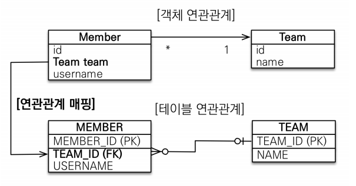
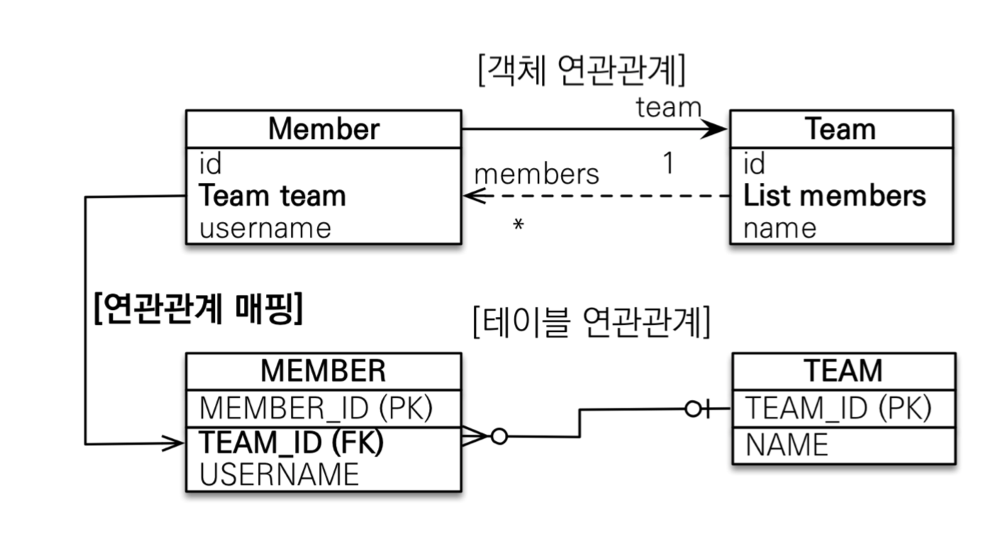
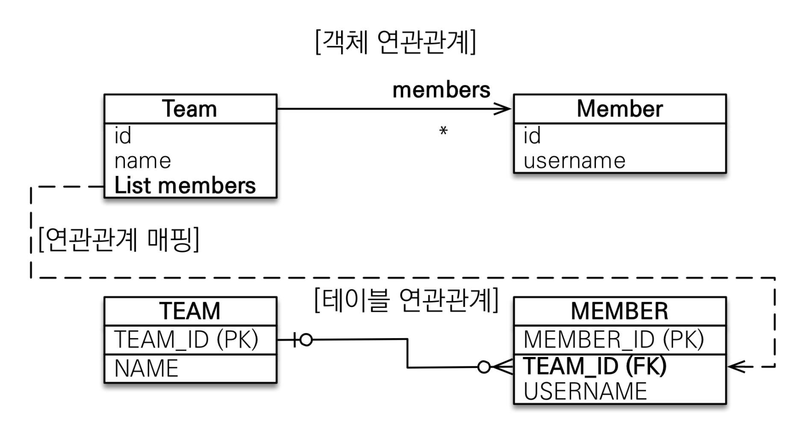
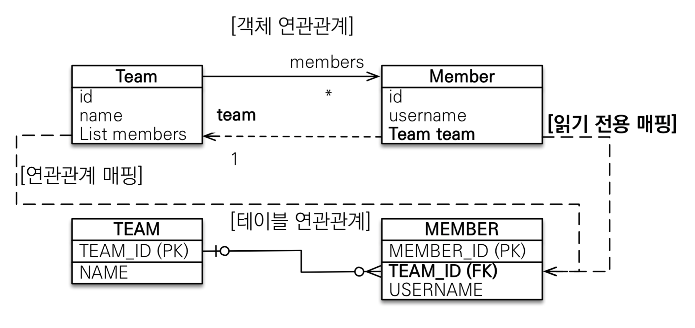
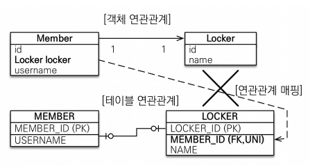
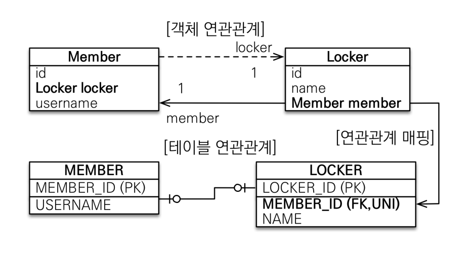

# Chapter 6. 다양한 연관관계 매핑

엔티티의 연관관계를 매핑할 때는 3가지 사항을 고려해야함
* 다중성
* 단방향, 양방향
* 연관관계의 주인

먼저 두 엔티티의 연관관계가 일대일/일대다 인지 다중성을 고려해야함  
두 엔티티 중 한쪽으로 참조하는 단방향 관계인지, 서로 참조하는 양방향 관계인지 고려  
양방향 관계면 연관관계의 주인을 정해야 함  

1. 다중성  
    - 다대일 (@ManyToOne)
    - 일대다 (@OneToMany)
    - 일대일 (@OneToOne)
    - 다대다 (@ManyToMany)
    
    다중성 판단이 어려운 경우에는 반대방향을 생각해보자  
    (일대다 - 다대일, 일대일 - 일대일)  
    
2. 단방향, 양방향  
    테이블은 외래 키 하나로 조인을 사용하여 양방향으로 쿼리가 가능해서 방향의 개념이 없음  
    반면, 객체는 참조용 필드를 가지고 있는 객체만 연관된 객체를 조회할 수 있음  
    
3. 연관관계의 주인 
    DB는 외래 키 하나로 두 테이블이 연관관계를 맺기에 관리 포인트는 한 곳  
    엔티티는 양방향으로 매핑하면 관리하는 포인트가 두 곳  
    이 두 곳중 하나를 정해서 DB 외래키를 관리하는데, 이것을 연관관계의 주인이라고 함  
    <b>외래 키를 가진 테이블과 매핑한 엔티티가 외래 키를 관리하는게 효율적이므로 보통 이곳을 연관관계의 주인으로 선택</b>  
    다중성과 단방향, 양방향을 고려한 모든 연관관계는 아래와 같음  
    * 다대일 : 단방향, 양방향
    * 일대다 : 단방향, 양방향
    * 일대일 : 주 테이블 단방향, 양방향
    * 일대일 : 대상 테이블 단방향, 양방향
    * 다대다 : 단방향, 양방향
    
## 6.1 다대일

DB 테이블의 일, 다 관계에서 외래 키는 항상 다쪽에 있음  
따라서, 객체 양방향 관계에서 연관관계의 주인은 항상 다쪽

### 6.1.1 다대일 단방향 [N:1]

회원은 Member.team으로 팀 엔티티를 참조할 수 있지만, 팀에는 회원을 참조할 필드가 없음  
따라서 회원과 팀은 다대일 단방향 연관관계
@JoinColumn (name="TEAM_ID")를 사용해서 Member.team 필드를 TEAM_ID 외래키와 매핑  

### 6.1.2 다대일 양방향 [N:1, 1:N]

* 양방향은 외래 키가 있는 쪽이 연관관계의 주인  
일대다와 다대일 연관관계는 항상 다(N)에 외래키가 있음
다쪽인 테이블에 외래 키를 가지고 있으므로 Member.team이 연관관계의 주인. JPA는 외래 키를 관리할 대 연관관계의 주인만 사용. 나머지는 조회를 위한 JPQL이나 객체 그래프를 탐색할 때 사용    
* 양방향 연관관계는 항상 서로를 참조해야 함
 양방향 연관관계는 항상 서로 참조해야 함. 이를 유지하기 위해선 편의 메소드를 작성하는 것이 좋은데 회원의 setTeam(), 팀의 addMember() 메소드가 이런 편의 메소드들임. 편의 메소드는 한 곳에만 작성하거나 양쪽 다 작성할 수 있는데, 양쪽에 다 작성하면 무한루프에 빠지므로 주의해야함.
 
## 6.2 일대다

다대일 관계의 반대방향. 엔티티를 하나 이상 참조할 수 있으므로 자바 컬렉션인 Collections, List, Set, Map 중에 하나를 사용  

### 6.2.1 일대다 단방향 [1:N]  

하나의 팀은 여러 회원을 참조할 수 있는데 이런 관계를 일대다 관계라고 함.  
팀은 회원들을 참조하지만, 회원은 팀을 참조하지 않으면 둘의 관계는 단방향.

보통은 자신이 매핑한 테이블의 외래 키를 관리하는데, 이 매핑은 반대쪽 테이블에 있는 외래 키를 관리
-> 외래 키는 항상 다쪽 테이블에 있는데, 다 쪽인 Member 엔티티에는 외래 키를 매핑할 수 있는 참조 필드가 없음. 대신 반대쪽인 Team 엔티티에만 참조 필드인 members가 있기에, 반대편 테이블의 외래 키를 관리하는 특이한 모습이 나타남.

일대다 단방향 관계를 매핑할 때에는 @JoinColumn을 명시. 아니면 JPA는 연결 테이블을 중간에 두고 연관관계를 관리하는 조인 테이블 전략을 기본으로 사용해서 매핑.

* 일대다 단방향 매핑의 단점

매핑한 객체가 관리하는 외래 키가 다른 테이블에 있다는 점. 본인 테이블에 있다면 INSERT SQL로 엔티티의 저장과 연관관계 처리가 한번에 가능하지만, 다른 테이블에 외래 키가 있어 UPDATE SQL을 추가로 실행해서 연관관계를 처리해야 함  

* 일대다 단방향 매핑보다는 다대일 양방향 매핑을 사용하자

일대다 단방향 매핑을 사용하면 엔티티를 매핑한 테이블이 아닌 다른 테이블의 외래 키를 관리해야 함  
-> 성능의 문제도 있지만 관리도 부담스러움  
해결 방법으로는 일대다 단방향 매핑 대신에 다대일 양방향 매핑을 사용하는 것 (다대일 매핑은 관리해야 하는 외래키가 본인 테이블에 있음)

### 6.2.2. 일대다 단방향 [1:N, N:1]

일대다 단방향 매핑은 사실 존재하지 않음. 대신 다대일 양방향 매핑을 사용해야 함  
(일대다 양방향과 다대일 양방향은 사실 같은 말. 왼쪽은 연관관계의 주인으로 가정해서 분류)  
정확히 말하자면 양방향 매핑에서 @OneToMany는 연관관계의 주인이 될 수 없음. 왜냐하면 관계형 DB의 특성상 일대다, 다대일 관계는 항상 다 쪽에 외래키가 존재하기 때문. @ManyToOne에는 mappedBy 속성이 없음.

일대다 양방향 배핑이 완전히 불가능한 것은 아님. 일대다 단방향 매핑 반대편에 같은 외래 키를 사용하는 다대일 단방향 매핑을 읽기 전용으로 하나 추가하면 됨.  

단, 둘다 같은 키를 관리하므로 문제가 발생할 수 있음. 따라서 반대편인 다대일 쪽은 insertable = false, updatable = false 로 설정해서 읽기만 가능하게 설정  

일대다 양방향 매핑이라기보다는 일대다 단방향 매핑 + 다대일 단방향 매핑(읽기전용)  
-> 일대다 단방향 매핑이 가지는 단점을 그대로 지님

## 6.3 일대일 [1:1]

양쪽이 서로 하나의 관계만 가짐. 

* 일대일 관계는 그 반대도 일대일 관계
* 테이블 관계에서 일대다, 다대일은 항상 다(N)쪽이 외래키를 가졌지만, 일대일 관계에서는 주 테이블이나 대상 테이블 둘 중 어느 곳이나 외래키를 가질 수 있음.  -> 누가 외래키를 가질 것인지 선택해야함

1. 주 테이블에 외래 키
    주 객체가 대상 객체를 참조하는 것처럼 주 테이블에 외래 키를 두고 대상 테이블을 참조. 외래 키를 객체 참조와 비슷하게 사용할 수 있어 객체지향 개발자들이 선호.  
    (장점 : 주 테이블이 외래 키를 가지고 있으므로 주 테이블만 확인해도 대상 테이블과 연관관계가 있는지 알 수 있음) 
2. 대상 테이블에 외래 키 
    전통적인 데이터베이스 개발자들은 보통 대상 테이블에 외래 키를 두는 것을 선호함.  
    (장점 : 테이블 관계를 일대일에서 일대다로 변경할 때 테이블 구조를 그대로 유지할 수 있음)
    
### 6.3.1 주 테이블에 외래 키

<b>객체지향 개발자들은 주 테이블에 외래 키가 있는 것을 선호</b>  
JPA도 주 테이블에 외래 키가 있으면 좀 더 편리하게 매핑할 수 있음

* 단방향 

객체 매핑에 @OneToOne을 사용했고, DB에는 LOCKER_ID 외래 키에 유니크 제약 조건(UNI)을 추가함

양방향이므로 연관관계의 주인을 정해야함.MEMBER 테이블이 외래 키를 가지므로 Member 엔티티에 있는 Member.locker가 연관관계의 주인.따라서, 반대 매핑인 사물함의 Locker.member는 mapperBy를 선언해서 연관관계의 주인이 아님을 설정.

### 6.3.2 대상 테이블에 외래 키

<b>[단방향]</b>  

대상 테이블에 외래 키가 있는 단방향 관계는 JPA에서 지원하지 않음. 또한, 이러한 모양으로 매핑할 수도 없음.
단방향 관계를 Locker 에서 Member 방향으로 수정하거나, 양방향 관계로 만들고 Locker를 연관관계의 주인으로 설정해야 함.  
참고로 JPA2.0 부터 일대다 단방향 관계에서 대상 테이블에 외래 키가 있는 매핑을 허용. 일대일은 불가

<b>[양방향]</b> 

주 엔티티인 Member 엔티티 대신에 대상 엔티티인 Locker를 연관관계의 주인으로 만들어서 LOCKER 테이블의 외래 키를 관리하도록 함.

## 6.4 다대다 [N:N]

관계형 DB는 정규화된 테이블 2개로 다대다 관계를 표현할 수 없음.  
그래서 보통 다대다 관계를 일대다, 다대일 관계로 풀어내는 연결 테이블을 사용함.  
ex) 회원과 상품의 관계,. 서로 다대다 관계로써 각자의 테이블로만으로는 표현이 불가  

따라서 중간에 연결 테이블을 추가해야 함. 테이블을 사용해서 다대다 관계를 일대다, 다대일 관계로 풀어낼 수 있음.  
그런데 객체는 테이블과 다르게 객체 2개로 다댇 관계를 만들 수 있음.  
ex) 회원 객체는 컬렉션을 사용해서 상품들을 참조, 상품들도 컬렉션을 사용해서 회원들을 참조 (@ManyToMany 활용) 

### 6.4.1 다대다 : 단방향

@ManyToMany와 @JoinTable을 사용해서 연결 테이블을 바로 매핑. 따라서 회원과 상품을 연결하는 회원_상품(Member_Product) 엔티티 없이 매핑을 완료할 수 있음.  

[@JoinTable]
|속성|기능|
|:---|:---|
|@JoinTable.name|연결 테이블을 지정. ex) MEMBER_PRODUCT 테이블|
|@JoinTable.joinCloumns|현재 방향인 회원과 매핑할 조인 컬럼 정보를 지정. (MEMBER_ID)|
|@JoinTable.inverseJoinColumns|반대 방향인 상품과 매핑할 조인 컬럼 정보를 지정. (PRODUCT_ID)|

실행된 SQL을 보면 연결 테이블인 MEMBER_PRODUCT와 상품 테이블을 조인해서 연관된 상품을 조회

### 6.4.2 다대다 : 양방향

다대다 매핑이므로 역방향도 @ManyToMany를 사용. 그리고 양쪽 중 원하는 곳에 mappedBy로 연관관계의 주인을 지정 (없는 곳이 연관관계의 주인)

### 6.4.3 다대다 : 매핑의 한계와 극복, 연결 엔티티 사용

@ManyToMany를 사용하면 연결 테이블을 자동으로 처리해줘서 도메인 모델이 단순해지고 여러가지로 편리함.  
하지만 이 매핑을 실무에서 사용하기에는 한계가 있음  

ex) 회원이 상품을 주문하면 연결 테이블에 단순히 주문한 회원 아이디, 상품 아이디만 담고 끝나지 않음  
    보통은 연결 테이블에 주문 수량 컬럼이나 주문한 날짜 같은 컬럼이 더 필요  
    -> 컬럼이 추가되면 @ManyToMany를 사용할 수 없게 됨 (주문/상품 엔티티에는 추가한 컬럼을 매핑할 수 없음)

    
    회원상품 엔티티에서 기본 키를 매핑하는 @Id와 외래 키를 매핑하는 @JoinColumn을 동시에 사용해서 기본 키 + 외래 키를 한번에 매핑. 그리고 @IdClass를 사용해서 복합 기본 키를 매핑.
    
* 복합 기본 키
    회원상품 엔티티는 기본 키가 MEMBER_ID와 PRODUCT_ID로 이루어진 복합 기본 키  
    JPA에서 복합 키를 사용하려면 별도의 식별자 클래스를 만들어야 함. 그리고 엔티티에 @IdClass를 사용해서 식별자 클래스를 지정하면 됨. 
    복합 키를 위한 식별자 클래스는 아래와 같은 특징을 지님
    * 복합 키는 별도의 식별자 클래스로 만들어야 함
    * Serializable을 구현해야 함
    * equals와 hashCode 메소드를 구현해야 함
    * 기본 생성자가 있어야 함 
    * 식별자 클래스는 public이어야 함
    * @IdClass를 사용하는 방법 외에 @EmbeddedId를 사용하는 방법도 있음

* 식별 관계 
    회원 상품은 회원과 상품의 기본 키를 받아서 자신의 기본 키로 사용함. 이렇게 부모 테이블의 기본 키를 받아서 자신의 기본 키 + 외래 키로 사용하는 것을 데이터베이스 용어로 식별관계 (Identifying Relationship)라 함
    
    => 회원상품(MemberProduct)은 회원의 기본 키를 받아 자신의 기본 키로 사용함과 동시에 회원과의 관계를 위한 외래 키로 사용  
    상품의 기본 키도 받아서 자신의 기본 키로 사용함과 동시에 상품과의 관계를 위한 외래 키로 사용  
    MemberProductId 식별자 클래스로 두 기본 키를 묶어서 복합 기본 키로 사용
        
복합 키는 항상 식별자 클래스를 만들어야 함.  
ex) em.find()를 보면 생성한 식별자 클래스로 엔티티를 조회  
복합 키는 사용하는 방법도 복잡. 단순히 컬럼 하나만 기본 키로 사용하는 것과 비교해서 복합 키를 사용하면 ORM 매핑에서 처리할 일이 상당히 많아짐. (복합 키를 위한 식별자 클래스 만들기, @IdClass 또는 @EmbeddedId도 사용, 식별자 클래스에 equals, hashCode도 구현) 

### 6.4.4 다대다 : 새로운 기본 키 사용

추천하는 기본 키 생성 전략은 DB에서 자동으로 생성해주는 대리 키를 Long 값으로 사용하는 것.  
-> 간편하고 거의 영구히 쓸 수 있으며 비즈니스에 의존하지 않는다는 장점  
-> ORM 매핑 시에 복합 키를 만들지 않아도 되므로 간단히 매핑을 완성할 수 있음

이번에는 연결 테이블에 새로운 기본 키를 적용 (이름은 ORDER라고 새로 명명)  
대리 키를 사용함으로써 이전에 보았던 식별 관계에 복합 키를 사용하는 것보다 매핑이 단순하고 이해하기 쉬움.

저장, 조회 시에 식별자 클래스를 사용하지 않아 코드가 한결 단순해짐. 

### 6.4.5 다대다 연관관계 정리

다대다 관계를 풀어내어 연결 테이블을 만들 때 식별자를 어떻게 구성할지 선택해야 함

* <b>식별 관계</b> : 받아온 식별자를 기본 키 + 외래 키로 사용
*  <b>비식별 관계</b> : 받아온 식별자는 외래 키로만 사용하고 새로운 식별자를 추가함

DB 설계에서는 1번처럼 부모 테이블의 기본 키를 받아서 자식 테이블의 기본 키 + 외래 키로 사용하는 것을 식별 관계라, 2번 처럼 단순히 외래 키로만 사용하는 것을 비식별 관계라 함.  
객체 입장에서는 2번 처럼 비식별 관계를 사용하는 것이 복합 키를 위한 식별자 클래스를 만들지 않아도 되므로 단순하고 편리하게 ORM 매핑을 할 수 있음 (때문에 식별 보다는 비식별 관계를 추천)   