# Chapter 7. 고급 매핑

7장에서 다룰 고급 매핑 내용 요약

* 상속관계 매핑 : 객체의 상속 관계를 DB에 어떻게 매핑하는지 다룸.
* @MappedSuperclass : 등록일, 수정일 같이 여러 엔티티에서 공통으로 사용하는 매핑 정보만 상속받고 싶으면 이 기능을 사용하면 됨.
* 복합 키와 식별 관계 매핑 : DB의 식별자가 하나 이상일 때 매핑하는 방법을 다룸. 그리고 DB 설계에서 이야기하는 식별 관계와 비식별 관계에 대해서도 다룸.
* 조인 테이블 : 테이블은 외래 키 하나로 연관관계를 맺을 수 있지만 연관관계를 관리하는 연결 테이블을 두는 방법도 있음. 여기서는 이 연결 테이블을 매핑하는 방법을 다룸.
* 엔티티 하나에 여러 테이블 매핑하기 : 보통 엔티티 하나에 테이블 하나를 매핑하지만 엔티티 하나에 여러 테이블을 매핑하는 방법도 있음. 여기서는 이 매핑 방법을 다룸.

## 7.1 상속 관계 매핑

관계형 DB는 객체지향 언어에서 다루는 상속이라는 개념이 없음.  
대신 아래 그림과 같은 슈퍼타입 서브타입 관계 ( Super-Type Sub-Type Relationship) 라는 모델링 기법이 객체의 상속 개념과 가장 유사  
ORM에서 이야기하는 상속 관계 매핑은 객체의 상속 구조와 DB의 슈퍼타입 서브타입 관계를 매핑하는 것.

슈퍼타입 서브타입 논리 모델을 실제 물리 모델인 테이블로 구현할 때는 3가지 방법을 선택할 수 있음

* 각각의 테이블로 변환 : 각각을 모두 테이블로 만들고 조회할 때 조인을 사용. JPA에서는 조인 전략이라 함.
* 통합 테이블로 변환 : 테이블을 하나만 사용해서 통합. JPA에서는 단일 테이블 전략이라고 함.
* 서브타입 테이블로 변환 : 서브 타입마다 하나의 테이블을 만듦. JPA에서는 구현 클래스마다 테이블 전략이라 함.

### 7.1.1 조인 전략

조인 전략(Joined Strategy)은 엔티티 각각을 모두 테이블로 만들고 자식 테이블이 부모 테이블의 기본 키를 받아서 기본 키 + 외래 키로 사용하는 전략. 따라서 조회할 때 조인을 자주 사용.  
주의할 점으로는 객체는 타입으로 구분할 수 있지만, 테이블은 타입의 개념이 없음. 따라서 타입을 구분하는 컬럼을 추가해야 하는데, 여기서는 DTYPE 컬럼을 구분 컬럼으로 사용함.

1. @Inheritance(strategy=InheritanceType.JOINED) : 상속 매핑은 부모 클래스에 @inheritance를 사용해야 함. 그리고 매핑 전략을 지정해야 하는데 여기서는 조인 전략을 사용하므로 InheritanceType.JOINED를 사용함.
2. @DiscriminatiorColumn(name="DTYPE") : 부모 클래스에 구분 컬럼을 지정함. 이 컬럼으로 저장된 자식 테이블을 구분할 수 있음. 기본값이 DTYPE이므로 @DiscriminatorColumn으로 줄여 사용해도 됨.
3. @DiscriminatorValue("M") : 엔티티를 저장할 때 구분 컬럼에 입력할 값을 지정. 만약 영화 엔티티를 저장하면 구분 컬럼인 DTYPE에 값 M이 저장됨.

기본값으로 자식 테이블은 부모 테이블의 ID 컬럼명을 그대로 사용하는데, 만약 자식 테이블의 기본 키 컬럼명을 변경하고 싶으면 @PrimaryKeyJoinColumn을 사용하면 됨.

* 장점
    - 테이블이 정규화됨.
    - 외래 키 참조 무결성 제약조건을 활용할 수 있음.
    - 저장공간을 효율적으로 사용함. 
* 단점  
    - 조회할 때 조인이 많이 사용되므로 성능이 저하될 수 있음.
    - 조회 쿼리가 복잡함.
    - 데이터를 등록할 INSERT SQL을 두 번 실행함.
* 특징
    - JPA 표준 명세는 구분 컬럼을 사용하도록 하지만 하이버네이트를 포함한 몇몇 구현체는 구분 컬럼(@DiscriminatorColumn) 없이도 동작함.
* 관련 어노테이션
    - @PrimaryKeyJoinColumn, @DiscriminatorColumn, @DiscriminatorValue

### 7.1.2 단일 테이블 전략

단일 테이블 전략(Single-Table Strategy)은 이름 그래도 테이블을 하나만 사용함. 그리고 구분 컬럼(DTYPE)으로 어떤 자식 데이터가 저장되었는지 구분함. 조회할 때 조인을 사용하지 않으므로 일반적으로 가장 빠름.  

이 전략을 사용할 때 주의점은 자식 엔티티가 매핑한 컬럼은 모두 null을 허용해야 한다는 점. 예를 들어 Book 엔티티를 저장하면 ITEM 테이블의 AUTHOR, ISBN 컬럼만 사용하고 다른 엔티티와 매핑된 ARTIST, DIRECTOR, ACTOR 컬럼은 사용하지 않으므로 null이 입력되기 때문.

InheritanceType.SINGLE_TABLE로 지정하면 단일 테이블 전략을 사용함. 테이블 하나에 모든 것을 통합하므로 구분 컬럼을 필수로 사용해야 함. 단일 테이블 전략의 장단점은 하나의 테이블을 사용하는 특징과 관련 있음.

* 장점
    - 조인이 필요 없으므로 일반적으로 조회 성능이 빠름.
    - 조회 쿼리가 단순. 
* 단점
    - 자식 엔티티가 매핑한 컬럼은 모두 null을 사용해야 함.
    - 단일 테이블에 모든 것을 저장하므로 테이블이 커질 수 있음. 그러므로 상황에 따라서는 조회 성능이 오히려 느려질 수 있음. 
* 특징
    - 구분 컬럼을 꼭 사용해야 함. 따라서 @DiscriminatorColumn을 꼭 설정해야 함.
    - @DiscriminatorValue를 지정하지 않으면 기본으로 엔티티 이름을 사용함. (ex. Movie, Album, Book)

### 7.1.3 구현 클래스마다 테이블 전략

구현 클래스마다 테이블 전략 (Table-Per-Concrete-Class Strategy)은 자식 엔티티마다 테이블을 만듦. 그리고 자식 테이블 각각에 필요한 컬럼이 모두 있음.

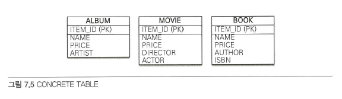

InheritanceType.TABLE_PER_CLASS를 선택하면 클래스마다 테이블 전략을 사용함. 이 전략은 자식 엔티티마다 테이블을 만듦. 일반적으로 추천하지 않은 전략.

* 장점
    - 서브 타입을 구분해서 처리할 때 효과적
    - not null 제약조건을 사용할 수 있음. 
* 단점
    - 여러 자식 테이블을 함께 조회할 때 성능이 느림 (SQL에 UNION을 사용해야 함.)
    - 자식 테이블을 통합해서 쿼리하기 어려움. 
* 특징  
    - 구분 컬럼을 사용하지 않음

이 전략은 DB 설계자와 ORM 전문가 둘다 추천하지 않는 전략. 조인이나 단일 테이블 전략을 고려하자.

## 7.2 @MappedSuperClass

부모 클래스는 테이블과 매핑하지 않고 부모 클래스를 상속받는 자식 클래스에게 매핑 정보만 제공하고 싶으면 @MappedSuperclass를 사용하면 됨.  
@Mappedsuperclass는 비유를 하자면 추상 클래스와 비슷한데 @Entity는 실제 테이블과 매핑되지만 @MappedSuperclass는 실제 테이블과는 매핑되지 않음. 단순히 매핑 정보를 상속할 목적으로만 사용됨.

회원과 관계자는 서로 관계가 없는 테이블과 엔티티. BaseEntity에는 객체들이 주로 사용하는 공통 매핑 정보를 정의함. 그리고 자식 엔티티들은 상속을 통해 BaseEntity의 매핑 정보를 물려받음. 여기서 BaseEntity는 테이블과 매핑할 필요가 없고 자식 엔티티에게 공통으로 사용되는 매핑 정보만 제공하면 됨. 따라서 @MappedSuperclass를 사용함.  

부모로부터 물려받은 매핑 정보를 재정의하려면 @AttributeOverrides나 @AttributeOverride를 사용하고, 연관관계를 재정의하려면 @AssociationOverrides나 @AssociationOverride를 사용함.

* 특징
    - 테이블과 매핑되지 않고 자식 클래스에 엔티티의 매핑 정보를 상속하기 위해 사용함.
    - @MappedSuperclass로 지정한 클래스는 엔티티가 아니므로 em.find()나 JPQL에서 사용할 수 없음.
    - 이 클래스를 직접 생성해서 사용할 일은 거의 없으므로 추상 클래스로 만드는 것을 권장.

@MappedSuperclass는 테이블과는 관계가 없고 단순히 엔티티가 공통으로 사용하는 매핑 정보를 모아주는 역할을 할 뿐. ORM에서 이야기하는 진정한 상속 매핑은 이전에 학습한 객체 상속을 DB의 슈퍼타입 서브타입 관계와 매핑하는 것.  
@MappedSuperclass를 사용하면 등록일자, 수정일자, 등록자, 수정자 같은 여러 엔티티에서 공통으로 사용하는 속성을 효과적으로 관리할 수 있음.  

## 7.3 복합 키와 식별 관계 매핑

### 7.3.1 식별 관계 vs 비식별 관계

DB 테이블 사이에 관계는 외래 키가 기본 키에 포함되는지 여부에 따라 식별 관계와 비식별 관계로 구분함. 두 관계의 특징을 이해하고 각각을 어떻게 매핑하는지 알아보는 것이 관건.

* 식별 관계

    식별 관계는 부모 테이블의 기본 키를 내려받아서 자식 테이블의 기본 키 + 외래 키로 사용하는 관계.
    
    

    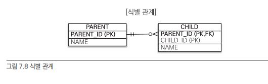
    

    
    그림에서 CHILD 테이블은 PARENT 테이블의 기본 키를 받아와 기본 키 + 외래 키로 사용함.
    
* 비식별 관계  

    비식별 관계는 부모 테이블의 기본 키를 받아서 자식 테이블의 외래 키로만 사용하는 관계.
    
    

    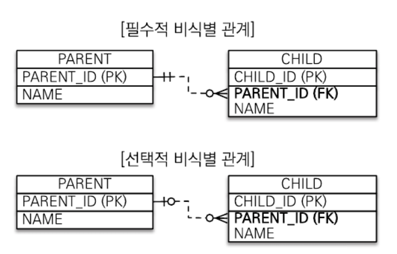
    

        
    그림에서 CHILD 테이블은 PARENT 테이블의 기본 키를 받아와 외래키로만 사용함. 외래 키에 NULL을 허용하는지에 따라 필수적 비식별 관계와 선택적 비식별 관계로 나눔.
    
    - 필수적 비식별 관계 (Mandatory) : 외래 키에 NULL을 허용하지 않음. 연관관계를 필수적으로 맺어야 함.
    - 선택적 비식별 관계 (Optional) : 외래 키에 NULL을 허용. 연관관계를 맺을지 말지 선택할 수 있음.
    
    DB 테이블을 설계할 때 식별 관계나 비식별 관계 중 하나를 선택해야 함. 최근에는 비식별 관계를 주로 사용하고 꼭 필요한 곳에만 식별 관계를 사용하는 추세. JPA는 식별 관계와 비식별 관계를 모두 지원함.
    
### 7.3.2 복합 키 : 비식별 관계 매핑

둘 이상의 컬럼으로 구성된 복합 기본 키는 아래와 같이 매핑하면 될 것 같지만 막상 해보면 매핑 오류가 발생. JPA에서 식별자를 둘 이상 사용하려면 별도의 식별자 클래스를 만들어야 함.

~~~ 
@Entity
public class Hello {
    @Id
    private String id1;
    @Id
    private String id2; // 실행 시점에 매핑 예외 발생
}    
~~~   
   
JPA는 영속성 컨텍스트에 엔티티를 보관할 때 엔티티의 식별자를 키로 사용함. 그리고 식별자를 구분하기 위해 equals와 hashCode를 사용해서 동등성 비교를 함. 그런데 식별자 필드가 하나일 때는 보통 자바의 기본 타입을 사용하므로 문제가 없지만, 식별자 필드가 2개 이상이면 별도의 식별자 클래스를 만들고 그곳에 equals와 hashCode를 구현해야 함.  
JPA는 복합 키를 지원하기 위해 @IdClass와 @EmbeddedId 2가지 방법을 제공하는데 @IdClass는 관계형 DB에 가까운 방법이고, @EmbeddedId는 좀 더 객체지향에 가까운 방법.

[@IdClass]

    

위 그림은 비식별 관계고 PARENT는 복합 기본 키를 사용함. 참고로 여기서 이야기하는 부모-자식은 객체의 상속과는 무관함. 단지 테이블의 키를 내려받은 것을 강조하려고 이와 같이 명명함.

복합키를 매핑하기 위해 클래스를 별도로 만들어야 함.
먼저 각각의 기본 키 칼럼을 @Id로 매핑하고, @IdClass를 사용해서 ParentId 클래스를 식별자 클래스로 지정.  
@IdClass를 사용할 때 식별자 클래스는 다음 조건을 만족해야 함.

* <b>식별자 클래스의 속성명과 엔티티에서 사용하는 식별자의 속성명이 같아야 함.</b>
* Serializable 인터페이스를 구현해야 함.
* equals, hashCode를 구현해야 함.
* 기본 생성자가 있어야 함.
* 식별자 클래스는 public 이어야 함.

저장 코드를 보면 식별자 클래스인 ParentId가 보이지 않는데, em.persist()를 호출하면 영속성 컨텍스트에 엔티티를 등록하기 직전에 내부에서 값을 사용해서 식별자 클래스인 ParentId를 생성하고 영속성 컨텍스트의 키로 사용함.  
조회 코드를 보면 식별자 클래스인 ParentId를 사용해서 엔티티를 조회함.  
부모 테이블의 기본 키 컬럼이 복합 키이므로 자식 테이블의 외래 키도 복합 키임. 따라서 외래 키 매핑 시 여러 컬럼을 매핑해야 하므로 @JoinColumns 어노테이션을 사용하고 각각의 외래 키 컬럼을 @JoinColumn으로 매핑. (참고로, @JoinColumn의 name 속성과 referencedColumnName 속성의 값이 같으면 referencedColumnName은 생략해도 됨)

[@EmbeddedId]

@IdClass가 DB에 맞춘 방법이라면, @EmbeddedId는 좀 더 객체지향적인 방법임.

Parent 엔티티에서 식별자 클래스를 직접 사용하고 @EmbeddedId 어노테이션을 적어주면 됨. @IdClass와는 다르게 @EmbeddedId를 적용한 식별자 클래스는 식별자 클래스에 기본 키를 직접 매핑함.  
@EmbeddedId를 적용한 식별자 클래스는 다음 조건을 만족해야 함.
* @Embeddable 어노테이션을 붙여주어야 함.
* Serializable 인터페이스를 구현해야 함.
* equals, hashCode를 구현해야 함.
* 기본 생성자가 있어야 함.
* 식별자 클래스는 public이어야 함.

저장하는 코드를 보면 식별자 클래스 parentId를 직접 생성해서 사용함. 조회 코드도 식별자 클래스 parendId를 직접 사용.

[복합 키와 equals(), hashCode()]

복합 키는 equals(), hashCode()를 필수로 구현해야 함.

~~~ 
ParentId id1 = new parentId();
id1.setId1("myId1");
id2.setID2("myId2");

ParentId id2 = new parentId();
id2.setId1("myId1");
id2.setId2("myId2");

id1.equals(id2) -> ?
~~~  

id1과 id2 인스턴스 둘 다 myId1, myId2라는 같은 값을 가지고 있지만 인스턴스는 다름. 그렇다면 마지막 줄의 코드는 참/거짓?  
equals()를 적절히 오버라이딩했다면 참이겠지만 equals()를 적절히 오바리이딩하지 않았더라면 거짓. 왜냐하면 자바의 모든 클래스는 기본으로 Object 클래스를 상속받는데 이 클래스가 제공하는 기본 equals()는 인스턴스 참조 값 비교인 == 비교(동일성 비교)를 하기 때문.  
영속성 컨텍스트는 엔티티의 식별자를 키로 사용해서 엔티티를 관리. 그리고 식별자를 비교할 때 equals()와 hashCode()를 사용함. 따라서 식별자 객체의 동등성(equals 비교)이 지켜지지 않으면 예상과 다른 엔티티가 조회되거나 엔티티를 찾을 수 없는 등 영속성 컨텍스트가 엔티티를 관리하는 데 심각한 문제가 발생함.  
따라서 복합 키는 equals()나 hashCode()를 필수로 구현해야 함. 식별자 클래스는 보통 equals()와 hashCode()를 구현할 때 모든 필드를 사용함.

[@IdClass vs @EmbeddedId]

@IdClass와 @EmbeddedId는 각각 장단점이 있으므로 본인의 취향에 맞는 것을 일관성 있게 사용하면 됨. @EmbeddedId가 @IdClass와 비교해서 더 객체지향적이고 중복도 없어서 좋아보이긴 하지만 특정 상황에 JPQL이 조금 더 길어질 수 있음.

### 7.3.3 복합 키 : 식별 관계 매핑

    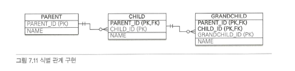

부모, 자식, 손자까지 계속 기본 키를 전달하는 식별 관계. 식별 관계에서 자식 테이블은 부모 테이블의 기본 키를 포함해서 복합 키를 구성해야 하므로 @IdClass나 @EmbeddedId를 사용해서 식별자를 매핑해야 함.

[@IdClass와 식별 관계]

식별 관계는 기본 키와 외래 키를 같이 매핑해야 함. 따라서 식별자 매핑인 @Id와 연관관계 매핑인 @ManyToOne을 같이 사용하면 됨.

Child 엔티티의 parent 필드를 보면 @Id로 기본 키를 매핑하면서 @ManyToOne과 @JoinColumn으로 외래 키를 같이 매핑함.

[@EmbeddedId와 식별 관계]

@EmbeddedId로 식별 관계를 구성할 때는 @MapsId를 사용해야 함. @IdClass와 다른 점은 @Id 대신에 @MapsId를 사용한 점. @MapsId는 외래 키와 매핑한 연관관계를 기본 키에도 매핑하겠다는 뜻. @MapsId의 속성 값은 @EmbeddedId를 사용한 식별자 클래스의 기본 키 필드를 지정하면 됨.

### 7.3.4 비식별 관계로 구현

    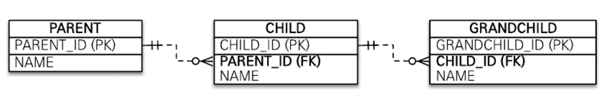

식별 관계의 복합 키를 사용한 코드와 비교하면 매핑도 쉽고 코드도 단순함. 그리고 복합 키가 없으므로 복합 키 클래스를 만들지 않아도 됨.

### 7.3.5 일대일 식별 관계

    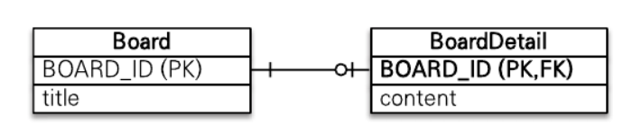

일대일 식별 관계는 자식 테이블의 기본 키 값으로 부모 테이블의 기본 키 값만 사용함. 그래서 부모 테이블의 기본 키가 복합 키가 아니면 자식 테이블의 기본 키는 복합 키로 구성하지 않아도 됨.

BoardDetail 처럼 식별자가 단순히 컬럼 하나면 @MapsId를 사용하고 속성 값은 비워두면 됨. 이때 @MapsId는 @Id를 사용해서 식별자로 지정한 BoardDetail.boardId와 매핑됨.

### 7.3.6 식별, 비식별 관계의 장단점

DB 설계 관점에서 보면 다음과 같은 이유로 식별 관계보다는 비식별 관계를 선호함.

* 식별 관계는 부모 테이블의 기본 키를 자식 테이블로 전파하면서 자식 테이블의 기본 키 컬럼이 점점 늘어남. 예를 들어, 부모 테이블은 기본 키 컬럼이 하나였지만 자식 테이블은 기본 키 컬럼이 2개, 손자 테이블은 기본 키 컬럼이 3개로 점점 늘어남. 결국 조인할 때 SQL이 복잡해지고 기본 키 인덱스가 불필요하게 커질 수 있음.
* 식별 관계는 2개 이상의 컬럼을 합해서 복합 기본 키를 만들어야 하는 경우가 많음.
* 식별 관계를 사용할 때 기본 키로 비즈니스 의미가 있는 자연 키 컬럼을 조합하는 경우가 많음. 반면에 비식별 관계의 기본 키는 비즈니스와 전혀 관계없는 대리 키를 주로 사용함. 비즈니스 요구사항은 시간이 지남에 따라 언젠가는 변하기에, 식별 관계의 자연 키 컬럼들이 자식에 손자까지 전파되면 변경하기 어려움.
* 식별 관계는 부모 테이블의 기본 키를 자식 테이블의 기본 키로 사용하므로 비식별 관걔보다 테이블 구조가 유연하지 못함.  
 <b>객체 관계 매핑의 관점에서 아래와 같은 이유로 비식별 관계를 선호</b>
* 일대일 관계를 제외하고 식별 관계는 2개 이상의 컬럼을 묶은 복합 기본 키를 사용함. JPA에서 복합 키는 별도의 복합 키 클래스를 만들어서 사용해야 함. 따라서 컬럼이 하나인 기본 키를 매핑하는 것보다 많은 노력이 필요.
* 비식별 관계의 기본 키는 주로 대리 키를 사용하는데 JPA는 @GenerateValue처럼 대리 키를 생성하기 위한 편리한 방법을 제공.

식별관계도 나름의 장점을 가짐. 기본 키 인덱스를 활용하기 좋고, 상위 테이블들의 기본 키 컬럼을 자식, 손자 테이블들이 가지고 있으므로 특정 상황에 조인 없이 하위 테이블만으로 검색을 완료할 수 있음.

* 부모 아이디가 A인 모든 자식 조회
* 부모 아이디가 A고 자식 아이디가 B인 자식 조회

두 경우 모두 CHILD 테이블의 기본 키 인덱스를 PARENT_ID + CHILD_ID로 구성하면 별도의 인덱스를 생성할 필요 없이 기본 키 인덱스만 사용해도 됨.  
이같이 식별 관계가 가지는 장점도 있으므로 꼭 필요한 곳에는 적절하게 사용하는 것이 DB 테이블 설계의 묘를 살리는 방법.  

ORM 신규 프로젝트 진행 시 추천하는 방법은 될 수 있으면 <b>비식별 관계를 사용하고 기본 키는 Long 타입의 대리 키를 사용</b>하는 것. 대리 키는 비즈니스와 아무 관련이 없음. 따라서 비즈니스가 변경되어도 유연한 대처가 가능하다는 장점이 있음. JPA는 @GenerateValue를 통해 간편하게 대리 키를 생성할 수 있음. 그리고 식별자 컬럼이 하나여서 쉽게 매핑이 가능함. 식별자의 데이터 타입은 Long을 추천하는데, 자바에서 Integer는 20억 정도면 끝나버리므로 데이터를 많이 저장하면 문제가 발생하수 있음. 반면 Long은 약 920정까지 저장할 정도로 아주 큼.  
선택적 비식별 관계보다는 필수적 비식별 관계를 사용하는 것이 좋은데, 선택적인 비식별 관계는 NULL을 허용하므로 조인할 때에 외부 조인을 사용해야 함. 반면 필수적 관계를 NOT NULL로 항상 관계가 있다는 것을 보장하므로 내부 조인만 사용해도 됨.

## 7.4 조인 테이블

DB 테이블의 연관관계를 설계하는 방법은 크게 2가지

* 조인 컬럼 사용(외래 키)
* 조인 테이블 사용(테이블 사용)

[조인 컬럼 사용]

테이블 간에 관계는 주로 조인 컬럼이라 부르는 외래 키 컬럼을 사용해서 관리함.

    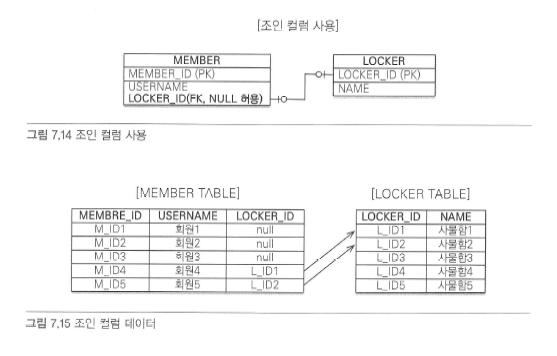

회원과 사물함이 있고 각각 테이블에 데이터를 등록했다가 회원이 원할 때 사물함을 선택할 수 있다고 가정. 회원이 사물함을 사용하기 전까지는 아직 둘 사이에 관계가 없으므로 MEMBER 테이블의 LOCKER_ID 외래 키에 null을 입력해야 함. 이렇게 외래 키에 null을 허용하는 관계를 선택적 비식별 관계라 함.  
선택적 비식별 관계는 외래 키에 null을 허용하므로 회원과 사물함을 조인할 때 외부 조인을 사용해야 함. 그리고 회원과 사물함이 아주 가끔 관계를 맺는다면 외래 키 값 대부분이 null로 저장되는 단점이 있음.

[조인 테이블 사용]

조인 컬럼을 사용하는 대신에 조인 테이블을 사용해서 연관관계를 정리.

    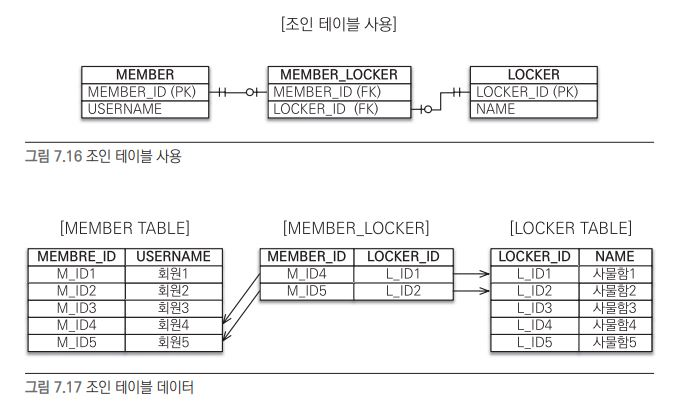

이 방법은 조인 테이블이라는 별도의 테이블을 사용해서 연관관계를 관리함. 조인 컬럼을 사용하는 방법은 단순히 외래 키 컬럼만 추가해서 연관관계를 맺지만 조인 테이블을 사용하는 방법은 연관관계를 관리하는 조인 테이블(MEMBER_LOCKER)을 추가하고 여기서 두 테이블의 외래 키를 가지고 연관관계를 관리함. 따라서 MEMBER와 LOCKER에는 연관관계를 관리하기 위한 외래 키 컬럼이 없음.  
회원과 사물함 데이터를 각각 등록했다가 회원이 원할 때 사물함을 선택하면 MEMBER_LOCKER 테이블에만 값을 추가하면 됨.  
조인 테이블의 가장 큰 단점은 테이블을 하나 추가해야 한다는 점. 따라서 관리해야 하는 테이블이 늘어나고 회원과 사물함 두 테이블을 조인하려면 MEMBER_LOCKER 테이블까지 추가로 조인해야 함. 따라서 기본은 조인 컬럼을 사용하고 필요하다고 판단되면 조인테이블 사용을 추천.

* 객체와 테이블을 매핑할 때 조인 컬럼은 @JoinColumn으로 매핑하고 조인 테이블은 @JoinTable로 매핑
* 조인 테이블은 주로 다대다 관계를 일대다, 다대일 관계로 풀어내기 위해 사용. 일대일, 일대다, 다대일 관계에서도 사용

### 7.4.1 일대일 조인 테이블

    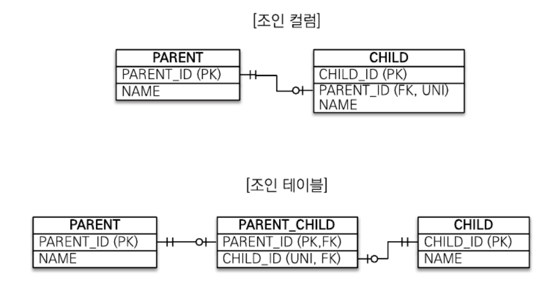

일대일 관계를 만드려면 조인 테이블의 외래 키 컬럼 각각에 총 2개의 유니크 제약 조건을 걸어야 함. (PARENT_ID는 기본 키이므로 유니크 제약조건이 걸려있음)

부모 엔티티를 보면 @JoinColumn 대신에 @JoinTable을 사용

|속성|기능|
|:---|:---|
|name|매핑할 조인 테이블 이름|
|joinColumns|현재 엔티티를 참조하는 외래 키|
|inverseJoinColumns|반대방향 엔티티를 참조하는 외래 키|

양방향으로 매핑하려면 다음 코드를 추가하면 됨 
~~~
public class Chile {
    ...
    @OneToOne (mappedBy="child")
    private Parent parent;
} 
~~~

### 7.4.2 일대다 조인 테이블

    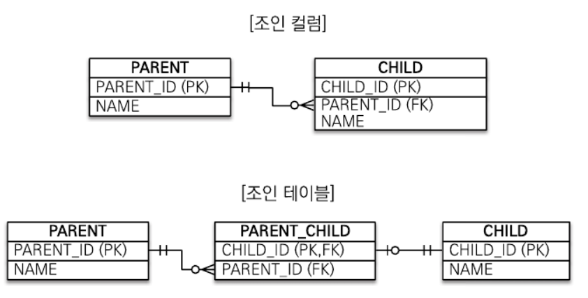

일대다 관계를 만드려면 조인 테이블의 컬럼 중 다(N)와 관련된 컬럼인 CHILD_ID에 유니크 제약조건을 걸어야 함. (CHILD_ID는 기본 키이므로 유니크 제약조건이 걸려있음.)

### 7.4.3 다대일 조인 테이블

다대일은 일대다에서 방향만 반대이므로 조인 테이블 모양은 일대다에서 설명한 그림과 같음. 

### 7.4.4 다대다 조인 테이블

    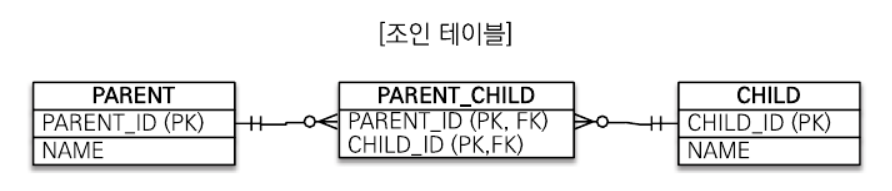

다대다 관계를 만들려면 조인 테이블의 두 컬럼을 합해서 하나의 복합 유니크 제약조건을 걸어야 함. (PARENT_ID, CHILD_ID는 복합 기본 키 이므로 유니크 제약 조건이 걸려 있음)

※ 조인 테이블에 컬럼을 추가하면 @JoinTable 전략을 사용할 수 없음. 대신에 새로운 엔티티를 만들어서 조인 테이블과 매핑해야 함.

## 7.5 엔티티 하나에 여러 테이블 매핑

잘 사용하지는 않지만 @SecondaryTable을 사용하면 한 엔티티에 여러 테이블을 매핑할 수 있음

    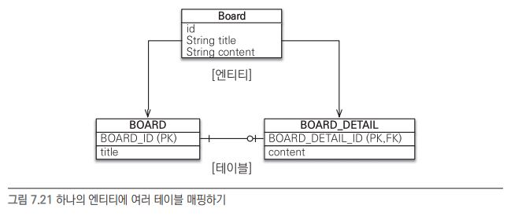

Board 엔티티는 @Table을 사용해서 BOARD 테이블과 매핑. 그리고 @SecondaryTable을 사용해서 BOARD_DETAIL 테이블을 추가로 매핑함.

|속성|기능|
|:---|:---|
|@SecondaryTable.name|매핑할 다른 테이블의 이름|
|@SecondaryTable.pkJoinColumns|매핑할 다른 테이블의 기본 키 컬럼 속성|

content 필드는 @Column(table = "BOARD_DETAIL")을 사용해서 BOARD_DETAIL 테이블의 컬럼에 매핑함. title 필드처럼 테이블을 지정하지 않으면 기본 테이블인 BOARD에 매핑됨.  
더 많은 테이블을 매핑하려면 @SecondaryTables를 사용하면 됨.  
참고로 @SecondaryTable을 사용해서 두 테이블을 하나의 엔티티에 매핑하는 방법보다 테이블당 엔티티를 각각 만들어서 일대일 매핑하는 것을 권장함. 이 방법은 항상 두 테이블을 조회하므로 최적하기 어렵기 때문. 반면 일대일 매핑은 원하는 부분만 조회할 수 있고 필요하면 둘을 함께 조회하면 됨.