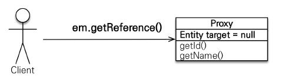
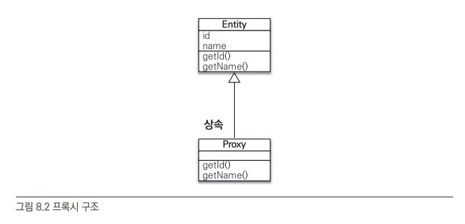
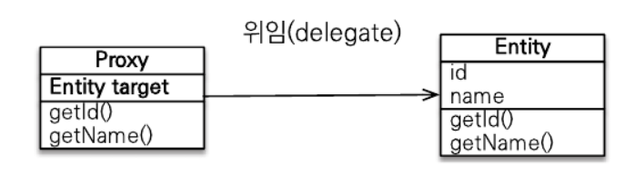
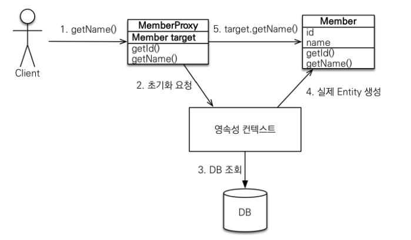

# Chapter 8. 프록시와 연관관계 관리

* 프록시와 즉시로딩, 자연로딩  
    객체는 객체 그래프로 연관된 객체들을 탐색함. 그런데 객체가 DB에 저장되어 있으므로 연관된 객체를 마음껏 탐색하기는 어려움. JPA 구현체들은 이 문제를 해결하려고 프록시라는 기술을 사용함. 프록시를 사용하면 연관된 객체를 처음부터 DB에서 조회하는 것이 아니라, 실제 사용하는 시점에 DB에서 조회할 수 있음. 하지만 자주 함께 사용하는 객체들은 조인을 사용해서 함게 조회하는 것이 효과적. JPA는 즉시 로딩과 지연 로딩이라는 방법으로 둘을 모두 지원함.
* 영속성 전이와 고아 객체  
    JPA는 연관된 객체를 함께 저장하거나 함께 삭제할 수 있는 영속성 전이와 고아 객체 제거라는 편리한 기능을 제공

## 8.1 프록시

엔티티를 조회할 때 연관된 엔티티들이 항상 사용되는 것은 아님.  
ex) 회원 엔티티를 조회할 때 연관된 팀 엔티티는 비즈니스 로직에 따라 사용될 때도 있지만 아닌 경우도 있음.

회원 엔티티만 사용하는 메소드는 em.find()로 회원 엔티티를 조회할 때 회원과 연관된 팀 엔티티(Member.team)까지 DB에서 함께 조회해 두는 것은 효율적이지 못함.  

JPA는 이런 문제를 해결하려고 엔티티가 실제 사용될 때까지 DB 조회를 지연하는 방법을 제공하는데, 이를 <b>지연 로딩</b>이라 함. 쉽게 말해 team.getName()처럼 팀 엔티티의 값을 실제 사용하는 시점에 DB에서 팀 엔티티에 필요한 DB롤 조회 하는 것. 이 방법을 사용하면 메소드는 회원 데이터만 DB에서 조회해도 됨.  
그런데 지연 로딩 기능을 사용하려면 실제 엔티티 객체 대신에 DB 조회를 지연할 수 있는 가짜 객체가 필요한데 이를 <b>프록시 객체</b>라고 함

### 8.1.1 프록시 기초

JPA에서 식별자로 엔티티 하나를 조회할 때는 EntityManager.find()를 사용함. 이 메소드는 영속성 컨텍스트에 엔티티가 없으면 DB롤 조회함. 엔티티를 직접 조회하면 조회한 엔티티를 실제 사용하건 말건 DB를 조회하게 되어 있음. 엔티티를 실제 사용하는 시점까지 DB 조회를 미루고 싶으면 EntityManager.getReference() 메소드를 사용하면 됨.  
이 메소드를 호출할 때 JPA는 DB를 조회하지 않고 실제 엔티티 객체도 생성하지 않음. 대신에 DB 접근을 위임한 프록시 객체를 반환함. 

* 프록시의 특징  
    프록시 클래스는 실제 클래스를 상속 받아 만들어지기에 실제 클래스와 겉 모양이 같음. 따라서 사용하는 입장에서는 이것이 진짜 객체인지 프록시 객체인지 구분하지 않고 사용하면 됨.

프록시 객체는 실제 객체에 대한 참조(target)를 보관함. 그리고 프록시 객체의 메소드를 호출하면 프록시 객체는 실제 객체의 메소드를 호출함.

* 프록시 객체의 초기화  
    프록시 객체는 member.getName()처럼 실제 사용될 때 DB를 조회해서 실제 엔티티 객체를 생성하는데 이것을 <b>프록시 객체의 초기화</b>라 함. 

1. 프록시 객체에 member.getName()을 호출해서 실제 데이터를 호출
2. 프록시 객체는 실제 엔티티가 생성되어 있지 않으면 영속성 컨텍스트에 실제 엔티티 생성을 요청하는데 이것을 초기화라 함
3. 영속성 컨텍스트는 DB를 조회해서 실제 엔티티 객체를 생성
4. 프록시 객체는 생성된 실제 엔티티 객체의 참조를 Member target 멤버변수에 보관
5. 프록시 객체는 실제 엔티티 객체의 getName()을 호출해서 결과를 반환
   
* 프록시의 특징
    - 프록시 객체는 처음 사용할 때 한 번만 초기화
    - 프록시 객체를 초기화한다고 프록시 객체가 실제 엔티티로 바뀌는 것은 아님. 프록시 객체가 초기화되면 프록시 객체를 통해서 실제 엔티티에 접근할 수 있음
    - 프록시 객체는 원본 엔티티를 상속받은 객체이므로 타입 체크 시에 주의해서 사용해야 함
    - 영속성 컨텍스트에 찾는 엔티티가 이미 있으면 DB를 조회할 필요가 없으므로 em.getReference()를 호출해도 프록시가 아닌 실제 엔티티를 반환함
    - 초기화는 영속성 컨텍스트의 도움을 받아야 가능. 따라서 영속성 컨텍스트의 도움을 받을 수 없는 준영속 상태의 프록시를 초기화하면 문제가 발생함. 하이버네이트는 org.hibernate.LazyInitializationException 예외를 발생  

 
* 준영속 사태와 초기화  
  
  em.close() 메소드로 영속성 컨텍스트를 종료해서 member는 준영속 상태임. member.getName()을 호출하면 프록시를 초기화해야 하는데 영속성 컨텍스트가 없으므로 실제 엔티티를 조회할 수 없음. 따라서 예외가 발생.

### 8.1.2 프록시와 식별자

엔티티를 프록시로 조회할 때 식별자(PK) 값을 파라미터로 전달하는데 프록시 객체는 이 식별자 값을 보관함.  
프록시 객체는 식별자 값을 가지고 있으므로 식별자 값을 조회하는 team.getId()를 호출해도 초기화하지 않음. 단 엔티티 접근 방식을 프로퍼티(@Access(AccessType.PROPERTY))로 설장한 경우에만 초기화하지 않음.  
엔티티 접근 방식을 필드(@Access(AccessType.PROPERTY))로 설정하면 JPA는 getId() 메소드가 id만 조회하는 메소드인지 다른 필드까지 활용해서 어떤 일을 하는 메소드인지 알지 못하므로 프록시 객체를 초기화 함.  
연관관계를 설정할 때는 식별자 값만 사용하므로 프록시를 사용하면 DB 접근 횟수를 줄일 수 있음. 참고로 연관관계를 설정할 때는 엔티티 접근 방식을 필드로 설정해도 프록시를 초기화 하지 않음.

### 8.1.3 프록시 확인

JPA가 제공하는 PersistenceUnitUitl.isLoaded(Object entity) 메소드를 사용하면 프록시 인스턴스의 초기화 여부를 확인할 수 있음. 아직 초기화되지 않은 프록시 인스턴스는 false를 반환함. 이미 초기화되었거나 프록시 인스턴스가 아니면 true를 반환.

조회한 엔티티가 진짜 엔티티인지 프록시로 조회한 것인지 확인하려면 클래스명을 직접 출력해보면 됨.  
ex) 클래스 명 뒤에 ..javassist..라 되어 있는데 이것으로 프록시인 것을 확인할 수 있음 (프록시를 생성하는 라이브러리에 따라 출력 결과가 달라질 수 있음)

※ 프록시 강제 초기화  
하이버네이트의 initialize() 메소드를 사용하면 프록시를 강제로 초기화할 수 있음.  
JPA 표준에는 프록시 강제 초기화 메소드가 없어, member.getName()처럼 프록시의 메소드를 직접 호출하면 됨. JPA 표준은 단지 초기화 여부만 확인할 수 있음.