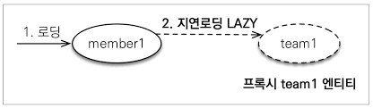

# Chapter 8. 프록시와 연관관계 관리

* 프록시와 즉시로딩, 자연로딩  
    객체는 객체 그래프로 연관된 객체들을 탐색함. 그런데 객체가 DB에 저장되어 있으므로 연관된 객체를 마음껏 탐색하기는 어려움. JPA 구현체들은 이 문제를 해결하려고 프록시라는 기술을 사용함. 프록시를 사용하면 연관된 객체를 처음부터 DB에서 조회하는 것이 아니라, 실제 사용하는 시점에 DB에서 조회할 수 있음. 하지만 자주 함께 사용하는 객체들은 조인을 사용해서 함게 조회하는 것이 효과적. JPA는 즉시 로딩과 지연 로딩이라는 방법으로 둘을 모두 지원함.
* 영속성 전이와 고아 객체  
    JPA는 연관된 객체를 함께 저장하거나 함께 삭제할 수 있는 영속성 전이와 고아 객체 제거라는 편리한 기능을 제공

## 8.1 프록시

엔티티를 조회할 때 연관된 엔티티들이 항상 사용되는 것은 아님.  
ex) 회원 엔티티를 조회할 때 연관된 팀 엔티티는 비즈니스 로직에 따라 사용될 때도 있지만 아닌 경우도 있음.

회원 엔티티만 사용하는 메소드는 em.find()로 회원 엔티티를 조회할 때 회원과 연관된 팀 엔티티(Member.team)까지 DB에서 함께 조회해 두는 것은 효율적이지 못함.  

JPA는 이런 문제를 해결하려고 엔티티가 실제 사용될 때까지 DB 조회를 지연하는 방법을 제공하는데, 이를 <b>지연 로딩</b>이라 함. 쉽게 말해 team.getName()처럼 팀 엔티티의 값을 실제 사용하는 시점에 DB에서 팀 엔티티에 필요한 DB롤 조회 하는 것. 이 방법을 사용하면 메소드는 회원 데이터만 DB에서 조회해도 됨.  
그런데 지연 로딩 기능을 사용하려면 실제 엔티티 객체 대신에 DB 조회를 지연할 수 있는 가짜 객체가 필요한데 이를 <b>프록시 객체</b>라고 함

### 8.1.1 프록시 기초

JPA에서 식별자로 엔티티 하나를 조회할 때는 EntityManager.find()를 사용함. 이 메소드는 영속성 컨텍스트에 엔티티가 없으면 DB롤 조회함. 엔티티를 직접 조회하면 조회한 엔티티를 실제 사용하건 말건 DB를 조회하게 되어 있음. 엔티티를 실제 사용하는 시점까지 DB 조회를 미루고 싶으면 EntityManager.getReference() 메소드를 사용하면 됨.  
이 메소드를 호출할 때 JPA는 DB를 조회하지 않고 실제 엔티티 객체도 생성하지 않음. 대신에 DB 접근을 위임한 프록시 객체를 반환함. 

<p align="center">

</p>

* 프록시의 특징  
    프록시 클래스는 실제 클래스를 상속 받아 만들어지기에 실제 클래스와 겉 모양이 같음. 따라서 사용하는 입장에서는 이것이 진짜 객체인지 프록시 객체인지 구분하지 않고 사용하면 됨.

<p align="center">

</p>

프록시 객체는 실제 객체에 대한 참조(target)를 보관함. 그리고 프록시 객체의 메소드를 호출하면 프록시 객체는 실제 객체의 메소드를 호출함.

<p align="center">

</p>

* 프록시 객체의 초기화  
    프록시 객체는 member.getName()처럼 실제 사용될 때 DB를 조회해서 실제 엔티티 객체를 생성하는데 이것을 <b>프록시 객체의 초기화</b>라 함. 

<p align="center">

</p>

1. 프록시 객체에 member.getName()을 호출해서 실제 데이터를 호출
2. 프록시 객체는 실제 엔티티가 생성되어 있지 않으면 영속성 컨텍스트에 실제 엔티티 생성을 요청하는데 이것을 초기화라 함
3. 영속성 컨텍스트는 DB를 조회해서 실제 엔티티 객체를 생성
4. 프록시 객체는 생성된 실제 엔티티 객체의 참조를 Member target 멤버변수에 보관
5. 프록시 객체는 실제 엔티티 객체의 getName()을 호출해서 결과를 반환
   
* 프록시의 특징
    - 프록시 객체는 처음 사용할 때 한 번만 초기화
    - 프록시 객체를 초기화한다고 프록시 객체가 실제 엔티티로 바뀌는 것은 아님. 프록시 객체가 초기화되면 프록시 객체를 통해서 실제 엔티티에 접근할 수 있음
    - 프록시 객체는 원본 엔티티를 상속받은 객체이므로 타입 체크 시에 주의해서 사용해야 함
    - 영속성 컨텍스트에 찾는 엔티티가 이미 있으면 DB를 조회할 필요가 없으므로 em.getReference()를 호출해도 프록시가 아닌 실제 엔티티를 반환함
    - 초기화는 영속성 컨텍스트의 도움을 받아야 가능. 따라서 영속성 컨텍스트의 도움을 받을 수 없는 준영속 상태의 프록시를 초기화하면 문제가 발생함. 하이버네이트는 org.hibernate.LazyInitializationException 예외를 발생  

<br>
* 준영속 사태와 초기화  
  
  em.close() 메소드로 영속성 컨텍스트를 종료해서 member는 준영속 상태임. member.getName()을 호출하면 프록시를 초기화해야 하는데 영속성 컨텍스트가 없으므로 실제 엔티티를 조회할 수 없음. 따라서 예외가 발생.

### 8.1.2 프록시와 식별자

엔티티를 프록시로 조회할 때 식별자(PK) 값을 파라미터로 전달하는데 프록시 객체는 이 식별자 값을 보관함.  
프록시 객체는 식별자 값을 가지고 있으므로 식별자 값을 조회하는 team.getId()를 호출해도 초기화하지 않음. 단 엔티티 접근 방식을 프로퍼티(@Access(AccessType.PROPERTY))로 설장한 경우에만 초기화하지 않음.  
엔티티 접근 방식을 필드(@Access(AccessType.PROPERTY))로 설정하면 JPA는 getId() 메소드가 id만 조회하는 메소드인지 다른 필드까지 활용해서 어떤 일을 하는 메소드인지 알지 못하므로 프록시 객체를 초기화 함.  
연관관계를 설정할 때는 식별자 값만 사용하므로 프록시를 사용하면 DB 접근 횟수를 줄일 수 있음. 참고로 연관관계를 설정할 때는 엔티티 접근 방식을 필드로 설정해도 프록시를 초기화 하지 않음.

### 8.1.3 프록시 확인

JPA가 제공하는 PersistenceUnitUitl.isLoaded(Object entity) 메소드를 사용하면 프록시 인스턴스의 초기화 여부를 확인할 수 있음. 아직 초기화되지 않은 프록시 인스턴스는 false를 반환함. 이미 초기화되었거나 프록시 인스턴스가 아니면 true를 반환.

조회한 엔티티가 진짜 엔티티인지 프록시로 조회한 것인지 확인하려면 클래스명을 직접 출력해보면 됨.  
ex) 클래스 명 뒤에 ..javassist..라 되어 있는데 이것으로 프록시인 것을 확인할 수 있음 (프록시를 생성하는 라이브러리에 따라 출력 결과가 달라질 수 있음)

※ 프록시 강제 초기화  
하이버네이트의 initialize() 메소드를 사용하면 프록시를 강제로 초기화할 수 있음.  
JPA 표준에는 프록시 강제 초기화 메소드가 없어, member.getName()처럼 프록시의 메소드를 직접 호출하면 됨. JPA 표준은 단지 초기화 여부만 확인할 수 있음.

## 8.2 즉시 로딩과 지연 로딩

프록시 객체는 주로 연관된 엔티티를 지연 로딩할 때 사용함.  
JPA는 개발자가 연관된 엔티티의 조회 시점을 선택할 수 있도록 두 가지 방법을 제공함.

* 즉시 로딩 : 엔티티를 조회할 때 연관된 엔티티도 함께 조회함.  
    |||
    |:---|:---|
    |예|em.find(Member.class, "Member1")를 호출할 때 회원 엔티티와 연관된 팀 엔티티도 함께 조회|
    |설정 방법| @ManyToOne(fetch = FetchType.EAGER)|
* 지연 로딩 : 연관된 엔티티를 실제 사용할 때 조회함.  
    |||
    |:---|:---|
    |예|member.getTeam().getName()처럼 조회한 팀 엔티티를 실제 사용하는 시점에 JPA가 SQL을 호출해서 팀 엔티티를 조회|
    |설정 방법| @ManyToOne(fetch = FetchType.LAZY)|

### 8.2.1 즉시 로딩

즉시 로딩(EAGER LOADING)을 사용하려면 @ManyToOne의 fetch 속성을 FetchType.EAGER로 저장

<p align="center">

</p>

em.find(Member.class, "member1")로 회원을 조회하는 순간 팀도 함게 조회. 이때 회원과 팀 두 테이블을 조회해야 하므로 쿼리를 2번 실행할 것 같지만, 대부분의 JPA 구현체는 <b>즉시 로딩을 최적화하기 위해 가능하면 조인 쿼리를 사용함.</b> 여기서는 회원과 팀을 조인해서 쿼리 한 번으로 두 엔티티를 모두 조회함.

※ NULL 제약 조건과 JPA 조인 전략  
즉시 로딩 실행 SQL에서 JPA가 내부 조인이 아닌 외부 조인을 사용한 것을 유심히 봐야함. 회원 테이블에 TEAM_ID 외래 키는 NULL 값을 허용하므로, 팀에 소속되지 않은 회원이 있을 가능성이 있음.  
JPA는 이런 상황을 고려해서 외부 조인을 사용함. 하지만 외부 조인 보다 내부 조인이 성능과 최적화에 더 유리함. 내부 조인을 사용하기 위해서는? 외래 키에 NOT NULL 제약 조건을 설정하면 값이 있는 것을 보장함.  
JPA에게도 이 사실을 알려야 하기에 <u>@JoinColumn에 nullable=false</u>을 설정해서 이 외래 키는 NULL 값을 허용하지 않는다고 알려주면, JPA는 외부 조인 대신에 내부 조인을 사용함.  

※ nullable 설정에 따른 조인 전략  
* @JoinColumn(nullable = true) : NULL 허용(기본값), 외부 조인 허용
* @JoinColumn(nullable = false) : NULL 허용하지 않음, 내부 조인 사용
  
혹은 <b><u>@ManyToOne.optional = false</u></b>로 설정해도 내부 조인을 사용

### 8.2.2  지연 로딩

지연 로딩(LAZY LOADING)을 사용하려면 @ManyToOne의 fetch 속성을 FetchType.LAZY로 지정

<p align="center">

</p>

em.find(Member.class, "member1")를 호출하면 회원만 조회하고 팀은 조회하지 않음. 대신에 조회한 회원의 team 멤버변수에 프록시 객체를 넣어둠.

```
Team team = member.getTeam();    // 프록시 객체
```
반환된 팀 객체는 프록시 객체. 이 프록시 객체는 실제 사용될 때까지 데이터 로딩을 미룸.  
실제 데이터가 필요한 순간이 되어서야 DB를 조회해서 프록시 객체를 초기화함.


※ 조회 대상이 영속성 컨텍스트에 이미 있으면 프록시 객체를 사용할 이유가 없음. 따라서 프록시가 아닌 실제 객체를 사용.  
ex) team1 엔티티가 영속성 컨텍스트에 이미 로딩되어 있으면 프록시가 아닌 실제 team1 엔티티를 사용

### 8.2.3 즉시 로딩, 지연 로딩 정리

처음부터 연관된 엔티티를 모두 영속성 컨텍스트에 올려두는 것은 현실적이니 않고, 필요할 때마다 SQL을 실행해서 연관된 엔티티를 지연 로딩하는 것도 최적화 관점에서 보면 좋은 것은 아님.   
ex) 대부분의 애플리케이션 로직에서 회우너과 팀 엔티티를 같이 사용한다면 SQL 조인을 사용해서 회원과 팀 엔티티를 한 번에 조회하는 것이 더 효율적.  
연관된 엔티티를 즉시 로딩하는 것이 좋은지 아니면 실제 사용할 때까지 지연해서 로딩하는 것이 좋은지는 상황에 따라 다름.

* 지연 로딩(LAZY) : 연관된 엔티티를 프록시로 조회. 프록시를 실제 사용할 때 초기화하면서 DB를 조회
* 즉시 로딩(EAGER) : 연관된 엔티티를 즉시 조회. 하이버네이트는 가능하면 SQL 조인을 사용해서 한 번에 조회

## 8.3 지연 로딩 활용

[사내 주문 관리 시스템] 개발 관련하여 클래스 모델 -> 엔티티 코드 -> 영속성 컨텍스트 다이어그램 -> SQL 순서대로 참고하기

### 8.3.1 프록시와 컬렉션 래퍼

다이어그램에서 즉시 로딩하면 실선, 지연 로딩하면 점선으로 표현함. 이렇게 지연 로딩으로 설정하면 실제 엔티티 대신에 프록시 객체를 사용함. 프록시 객체는 실제 자신이 사용될 때까지 DB를 조회하지 않음.  
하이버네이트는 엔티티를 영속 상태로 만들 때 엔티티에 컬렉션이 있으면 컬렉션을 추적하고 관리할 목적으로 원본 컬렉션을 하이버네이트가 제공하는 내장 컬렉션으로 변경하는데 이것을 <b>컬렉션 래퍼</b>라 함.출력 결과를 보면 컬렉션 래퍼인 org.hibernate.collection.internal.PersistentBag이 반환된 것을 확인할 수 있음.  
엔티티를 지연 로딩하면 프록시 객체를 사용해서 지연 로딩을 수행하지만 주문 내역 같은 컬렉션은 컬렉션 래퍼가 지연 로딩을 처리해줌. 컬렉션 래퍼도 컬렉션에 대한 프록시 역할을 하므로 따로 구분하지 않고 프록시로 부름.  
참고로 member.getOrders()를 호출해도 컬렉션은 초기화 되지 않음. 컬렉션은 member.getOrders().get(0)처럼 컬렉션에서 실제 데이터를 조회할 때 DB를 조회해서 초기화 함.  이때 FetchType.EAGER로 설정되어, 지연 로딩 상태인 주문 내역을 초기화할 때 연관된 상품도 함께 로딩됨.

<p align="center">

</p>

### 8.3.2 JPA 기본 페치 전략

JPA의 기본 페치(fetch) 전략은 연관된 엔티티가 하나면 즉시 로딩을, 컬렉션이면 지연 로딩을 사용함. 컬렉션을 로딩하는 것은 비용이 많이 들고 잘못하면 너무 많은 데이터를 로딩할 수 있기 때문.  
ex) 특정 회원이 연관된 컬렉션에 DB를 수만건 등록했는데, 설정한 페치 전략이 즉시 로딩이면 해당 회원을 로딩하는 순간 수만 건의 데이터도 함께 로딩. 반면에 연관된 엔티티가 하나면 즉시 로딩해도 문제가 안됨.  
<b>모든 연관관계에 지연 로딩을 사용하는 것을 추천.</b> 이후 애플리케이션 개발이 어느 정도 완료단계에 왔을 때 실제 사용하는 상황을 보고 꼭 필요한 곳에만 즉시 로딩을 사용하도록 최적화하면 됨.<br><br>
※ 참고로 SQL을 직접 사용하면 이런 유연한 최적화가 어려움.  
ex) SQL로 각각의 테이블을 조회해서 처리하다가 조인으로 한 번에 조회하도록 변경하려면 많은 SQL과 애플리케이션 코드를 수정해야 함.

### 8.3.3 컬렉션에 FetchType.EAGER 사용 시 주의점

* <b>컬렉션을 하나 이상 즉시 로딩하는 것은 권장하지 않음.</b> 컬렉션과 조인한다는 것은 DB 테이블로 보면 일대다 조인. 일대다 조인은 결과 데이터가 다 쪽에 있는 수만큼 증가하게 된다. 문제는 서로 다른 컬렉션을 2개 이상 조인할 때 발생 (ex. A 테이블을 N,M 두 테이블과 일대다 조인하면 SQL 실행 결과가 N * M 되면서 너무 많은 데이터를 반환할 수 있고, 결과적으로 애플리케이션 성능 저하를 초래함.) JPA는 이렇게 조회된 결과를 메모리에서 필터링해서 반환함. 따라서 2개 이상의 컬렉션을 즉시 로딩으로 설정하는 것은 권장하지 않음.
* <b>컬렉션 즉시 로딩은 항상 외부조인(OUTER JOIN)을 사용</b> 다대일 관계인 회원 테이블과 팀 테이블을 조회할 때 회원 테이블의 외래 키에 not null 제약조건을 걸어두면 모든 회원은 팀에 소속되므로 항상 내부 조인을 사용해도 됨. 반대로 팀 테이블에서 회원 테이블로 일대다 관계를 조인할 때 회원이 한 명도 없는 팀을 내부 조인하면 팀까지 조회되지 않는 문제가 발생함. DB 제약조건으로 이런 상황을 막을 수 없음. 따라서 JPA는 일대다 관계를 즉시 로딩할 때 항상 외부 조인을 사용함.

설정과 조인 전략을 정리하자면 아래와 같음
* @ManyToOne, @OneToOne
    * (optional = false) : 내부 조인
    * (optional = true) : 외부 조인
* @OneToMany, @ManyToMany
    * (optional = false) : 외부 조인
    * (optional = true) : 외부 조인