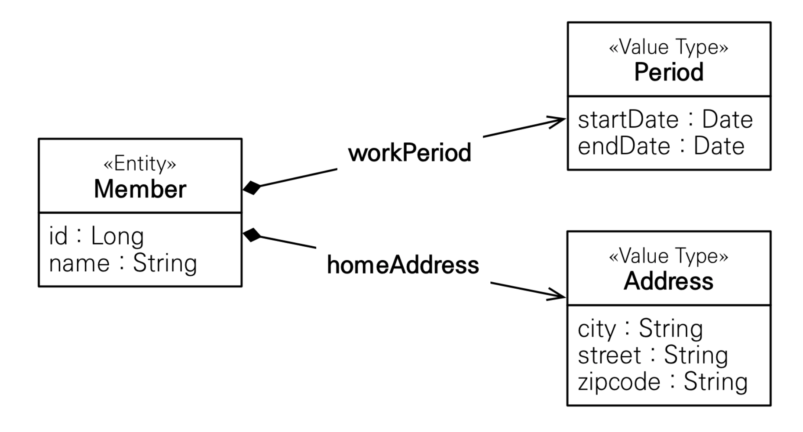
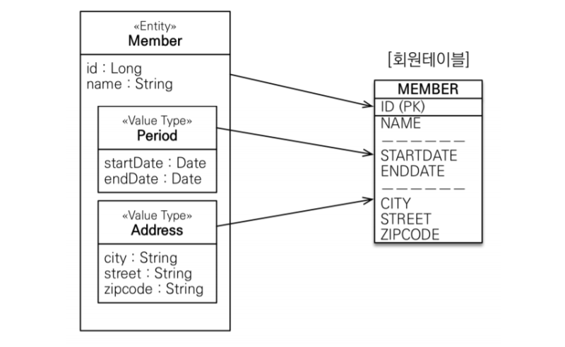
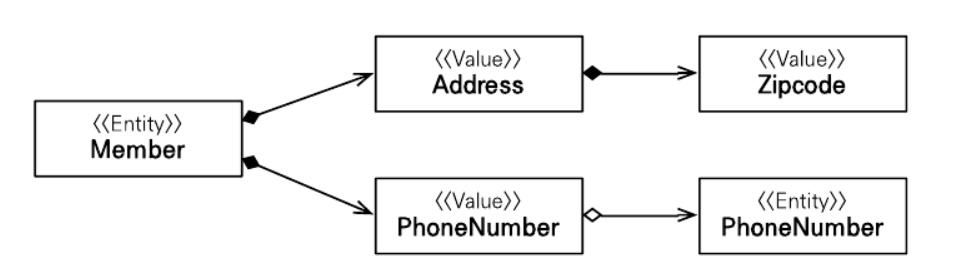
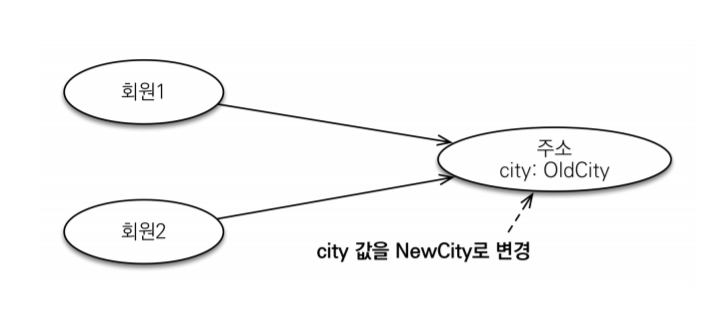
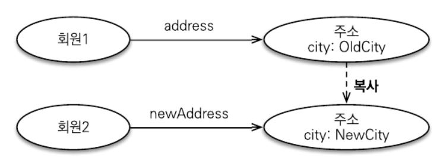

# Chapter 9. 값 타입

JPA 데이터 타입은 크게 엔티티 타입과 값 타입으로 나눌 수 있음  
엔티티 타입은 @Entity로 정의하는 객체이고, 값 타입은 int, Integer, Stringgg처럼 단순히 값으로 사용하는 자바 기본 타입이나 객체를 말함. 엔티티 타입은 식별자를 통해 지속해서 추적할 수 있지만, 값 타입은 식별자가 없고 숫자나 문자같은 속성만 있으므로 추적할 수 없음.  
ex) 회원 엔티티라는 것은 그 회원의 키나 나이 값을 변경해도 같은 회원. 심지어 그 회원의 모든 데이터를 변경해도 식별자만 유지하면 같은 회원으로 인식. 반면, 값 타입은 숫자 값 100을 200으로 변경하면 완전히 다른 값으로 바뀜.  

값 타입은 다음 3가지로 나눌 수 있음.
- 기본값 타입
  - 자바 기본 타입 (int, double)
  - 래퍼 클래스 (Integer)
  - String
- 임베디드 타입
- 컬렉션 값 타입

기본값 타입은 String, int  처럼 자바가 제공하는 기본 데이터 타입이고 임베디드 타입은 JPA에서 사용자가 직접 정의한 값 타입. 마지막 컬렉션 값 타입은 하나 이상의 값 타입을 저장할 때 사용.

## 9.1 기본값 타입

[책 예제 9.1 참고]

Member 엔티티는 id라는 식별자 값도 가지고 생명주기도 있지만 값 타입인 name, age 속성은 식별자 값도 없고 생명주기도 회원 엔티티에 의존함. 따라서 회원 엔티티 인스턴스를 제거하면 name, age 값도 제거됨. 그리고 값 타입은 공유하면 안됨.  
ex) 다른 회원 엔티티의 이름을 변경한다고 해서 내 이름까지 변경되면 안됨

## 9.2 임베디드 타입 (복합 값 타입)

새로운 값 타입을 직접 정의해서 사용할 수 있는데, JPA에서 이것을 임베디드 타입이라고 함. 중요한 것은 직접 정의한 임베디드 타입도 int, String 처럼 값 타입.

회원이 상세한 데이터를 그대로 가지는 것은 객체지향적이지 않으며 응집력을 떨어트림. 대신에 근무 기간, 주소 같은 타입이 있다면 코드가 더 명확해질 것

```
[값 타입 적용 회원 엔티티]

@Entity
public class Member {
  @Id @GeneratedValue
  private Long id;
  private String name;

  @Embedded Period workPeriod;    // 근무기간
  @Embedded Address homeAddress;  // 집주소
}

```
```
[기간 임베디드 타입]
@Embeddable 
public class Period {
  @Temporal .....
  @Temporal .....

  public boolean isWork(Date date) {
    //.. 값 타입을 위한 메소드 정의가 가능
  }
}
```

```
[주소 임메디드 타입]
@Embeddable
public class Address {
  @Column(name="city")  // 매핑할 컬럼 정의 가능
  private String city;
  private String street;
  private String zipcode;
  ...
}
```

새롭게 정의한 값 타입들은 재사용할 수 있고 응집도도 매우 높음. 또한, 해당 값 타입만 사용하는 의미 있는 메소드도 만들 수 있음.  
임베디드 타입을 사용하려면 2가지 어노테이션이 필요함. (한 개는 생략 가능)
* @Embeddable : 값 타입을 정의하는 곳에 표시
* @Embedded : 값 타입을 사용하는 곳에 표시  
-> 임베디드 타입은 기본 생성자가 필수  

임베디드 타입을 포함한 모든 값 타입은 엔티티의 생명주기에 의존하므로 엔티티와 임베디드 타입의 관계를 UML로 표현하면 컴포지션(Composition) 관계가 된다.

<p align="center">

</p>

### 9.2.1 임베디드 타입과 테이블 매핑

<p align="center">

</p>

임베디드 타입은 엔티티의 값일 뿐. 따라서 값이 속한 엔티티의 테이블에 매핑함. 임베디드 타입 덕분에 객체와 테이블을 아주 세밀하게(fine-grained) 매핑하는 것이 가능함. 잘 설계한 ORM 애플리케이션은 매핑한 테이블의 수보다 클래스의 수가 더 많음.  
ORM을 사용하지 않고 개발하면 테이블 컬럼과 객체 필드를 대부분 1:1로 매핑함. 주소나 근무 기간 같은 값 타입 클래스를 만들어서 더 객체지향적으로 개발하고 싶어도 SQL을 직접 다루면 테이블 하나에 여러 클래스를 매핑하는 문제가 생김. <b>이런 반복 작업은 JPA에 맡기고 더 세밀한 객체지향 모델을 설계하는 데 집중하는 것이 관건.</b>

### 9.2.2 임베디드 타입과 연관관계

임베디드 타입은 값 타입을 포함하거나 엔티티를 참조할 수 있음.  
JPA 표준 명세가 제공하는 연관관계를 살펴보자.

<p align="center">

</p>

### 9.2.3 @AttributeOverride: 속성 재정의

임베디드 타입에 정의한 매핑정보를 재정의하려면 엔티티에 @AttributeOverride를 사용하면 됨. 

ex) 한 명의 Member에 집 주소와 회사 주소를 추가하려면 컬럼명이 중복되는 문제 발생 -> @AttributeOverride로 매핑정보를 재정의

### 9.2.4 임베디드 타입과 null

임베디드 타입이 null이면 매핑한 컬럼 값은 모두 null이 된다.

## 9.3 값 타입과 불변 객체

값 타입은 복잡한 객체 세상을 조금이라도 단순화하려고 만든 개념. 따라서 값 타입은 단순하고 안전하게 다룰 수 있어야 함.

### 9.3.1 값 타입 공유 참조

임베디드 타입 같은 값 타입을 여러 엔티티에서 공유하면 위험함. 아래는 공유할 때 발생하는 문제.

<p align="center">

</p>

```
member1.setHomeAddress(new Address("OldCity"));
Address address = member1.getHomeAddress();

address.setCity("NewCity"); // 회원 1의 address 값을 공유해서사용
member2.setHomeAddress(address);
```

회원2에 새로운 주소를 할당하려고 회원1의 주소를 그대로 참조해서 사용한 모습. 이 코드를 실행하면? 회원2의 주소만 "NewCity"로 변경되길 기대하지만 회원1의 주소도 "NewCity"로 변경 됨. 두 회원 모두 같은 address 인스턴스를 참조하기 때문. 영속성 컨텍스트는 회원1과 회원2 둘 다 city 속성이 변경된 것으로 판단해서 회원1, 회원2 각각 UPDATE SQL을 실행함.  
이러한 공유 참조로 인해 발생하는 버그는 찾아내기 어려움. 뭔가를 수정했는데 전혀 예상치 못한 곳에서 문제가 발생하는 것은 부작용 (Side Effect)라고 함. 부작용을 막으려면 값을 복사해서 사용하면 됨.

### 9.3.2 값 타입 복사

값 타입의 실제 인스턴스인 값을 공유하는 것은 위험함. 대신 값(인스턴스)을 복사해서 사용해야 함.

<p align="center">

</p>

